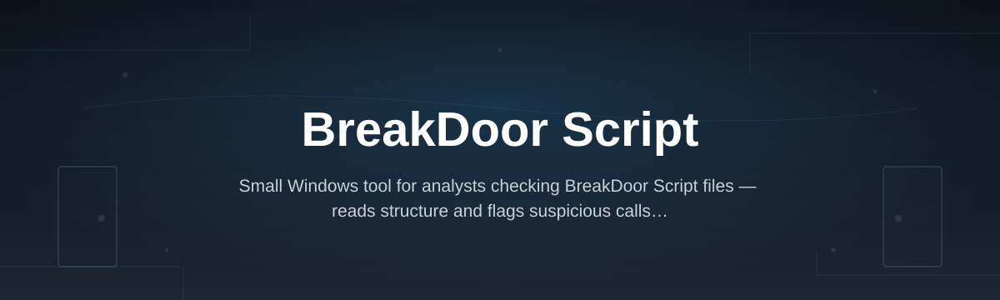
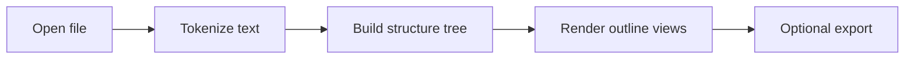

# breakdoor-script-analyzer

*A static inspection tool for reading BreakDoor Script files without running them.*

## What this is

BreakDoor Script is a compact scripting format used in a small number of game modding and automation communities, where files are shared, edited, and reused far more often than they are documented. Because the format has no official specification, understanding what a given BreakDoor Script file actually does — which functions it calls, what strings it references, how its control flow is structured — usually means opening it in a text editor and reading line by line.

breakdoor-script-analyzer replaces that manual reading with a structured view. It parses a BreakDoor Script file, builds a readable outline of its statements and function calls, and surfaces strings, constants, and flow structure in a single window. The tool does not execute the script or connect it to any game process; it only reads and displays the file's contents, which is what makes it useful for people who need to understand a script before deciding whether to trust, keep, or discard it.

  

The button above opens the project's landing page, where the current Windows build is available for download.

## Who it is for

- **Modding community members** who receive BreakDoor Script files from others and want to read them before running anything.
- **Server or community moderators** reviewing submitted scripts for content that shouldn't be shared.
- **Script authors** who want a quick outline view of their own files while editing.
- **Students of scripting languages** curious about how BreakDoor Script structures functions and control flow.
- **Archivists and researchers** cataloguing scripts from older or discontinued communities.

## What you can do

- **Open any `.bds` or `.txt` BreakDoor Script file** and get an instant structural breakdown.
- **View a function call list** showing every function defined and referenced in the file.
- **Read extracted strings and constants** without scrolling through raw source.
- **Inspect control-flow blocks** (loops, conditionals, branches) as a nested outline.
- **Flag unusual patterns**, such as heavily nested obfuscation or unreadable variable names.
- **Compare two script files** side by side to see what changed between versions.
- **Export the parsed outline** to a plain text report for notes or sharing.
- **Run entirely offline**, with no network requests made by the tool itself.

## Getting started

1. Visit the [landing page](https://SentrySpecialist.github.io/breakdoor-script-analyzer/) and download the current Windows build.
2. Extract the downloaded archive to a folder of your choice — no installer is required.
3. Launch `breakdoor-script-analyzer.exe`.
4. Use **File → Open** and select the BreakDoor Script file you want to inspect.
5. Read the generated outline in the main panel; use the side tabs to switch between functions, strings, and flow view.

## Requirements

- Windows 10 or Windows 11 (64-bit).
- No .NET, Python, or other runtime installation needed — the build is standalone.
- No external toolchain, compiler, or SDK required.
- Roughly 40 MB of free disk space for the extracted application.

## How it works

1. The tool reads the selected file as plain text and tokenizes it according to BreakDoor Script's syntax rules.
2. Tokens are grouped into statements — function definitions, calls, assignments, and conditionals.
3. A lightweight parser builds a tree representing the script's structure, without executing any instruction.
4. The tree is rendered into three linked views: function list, string table, and flow outline.
5. If requested, the outline is written out as a plain text or JSON report for saving or comparison.

## FAQ

**What is BreakDoor Script?**
It's an informal scripting format used in some modding and automation communities. It has no single official specification, so tools and conventions vary between the communities that use it.

**Does breakdoor-script-analyzer run or execute the script?**
No. It only reads the text of the file and builds a structural outline. Nothing in the file is executed by this tool.

**Can it open files that don't have a `.bds` extension?**
Yes, as long as the file's contents follow BreakDoor Script syntax, the analyzer will accept `.txt` or extension-less files too.

**Will it work on heavily obfuscated BreakDoor Script files?**
It will still parse the token structure and function calls, but readability of variable names and comments depends on what the original author left in the file.

**Is there a version for macOS or Linux?**
Not currently. The build is Windows-only; there are no plans announced for other platforms at this time.

## Troubleshooting

- **The application won't open.** Confirm you extracted the full archive rather than running the executable from inside it, and that Windows Defender hasn't quarantined a file — check your quarantine list if the app is missing after download.
- **A file fails to parse.** The script may use syntax outside the current parser's rules; try opening it in a text editor first to confirm it's valid BreakDoor Script and not corrupted or truncated.
- **The outline view is empty.** This usually means the file has no recognizable function definitions; check that you selected the correct file and that it isn't empty.
- **Export doesn't produce a file.** Make sure the analyzer has write permission to the target folder, or try exporting to your Documents folder instead of a system directory.

## License

This project is released under the [MIT License](LICENSE). It is provided as-is, for reading and understanding script files; it is not affiliated with any game, platform, or the original authors of any BreakDoor Script file you may analyze with it.

<p align="